## 15.3 Lesson Plan: Algorithmic Trading With Machine Learning

---

### Overview

Today's lesson shows students how to use machine learning models in their algorithmic trading framework.

### Class Objectives

By the end of class, students will be able to:

* Generate trading signals that can be used to train a machine learning model.

* Setup the training and testing time series data for a machine learning model.

* Train a random forest model that can predict returns.

* Save and load pre-trained machine learning models that can be used for algorithmic trading.

* Backtest a machine learning algorithmic trading model to characterize performance.

### Instructor Notes

* Students may be at or near their learning capacity by this point in the course, but encourage them to use today's material as a guide for incorporating machine learning models into an algorithmic trading strategy. These ideas can potentially be used in their projects.

* Have your TAs keep track with the [Time Tracker](TimeTracker.xlsx)

### Sample Class Video (Highly Recommended)

* To watch an example class lecture, go here: [15.3 Class Video.](https://codingbootcamp.hosted.panopto.com/Panopto/Pages/Viewer.aspx?id=a79f7419-2a51-4bc6-aa09-ab1c00f77a4b) Note that this video may not reflect the most recent lesson plan.

### Slideshow and Time Tracker

* The slides for this lesson can be viewed on Google Drive here: [15.3 Lesson Slides](https://docs.google.com/presentation/d/1ulDdO53mRd5pRy_6eFiRiSFVIK68BebCnP2lmQvvaiI/edit?usp=sharing).

* To add the slides to the student-facing repository, download the slides as a PDF by navigating to File, selecting "Download as," and then choosing "PDF document." Then, add the PDF file to your class repository along with other necessary files. You can view instructions for this [here](https://docs.google.com/document/d/1XM90c4s9XjwZHjdUlwEMcv2iXcO_yRGx5p2iLZ3BGNI/edit?usp=sharing).

* **Note:** Editing access is not available for this document. If you wish to modify the slides, create a copy by navigating to File and selecting "Make a copy...".

* The time tracker for this lesson can be found here: [Time Tracker](TimeTracker.xlsx)

---

### 1. Instructor Do: Generating Trading Signals (15 min)

**Corresponding Activity:** [01-Ins_Trading_Signal_Features](Activities/01-Ins_Trading_Signal_Features)

In this activity, students will learn how to generate a set of trading signals derived from raw BTC/USD data that will be used as features to train a Random Forest machine learning model that will autonomously make predictions and corresponding trades.

**File:** [trading_signal_features.ipynb](Activities/01-Ins_Trading_Signal_Features/Solved/trading_signal_features.ipynb)

First, quickly introduce the following:

* Now that students have learned to generate trading signals, backtest their trading strategies, and evaluate their results, it is time to incorporate machine learning into the mix! Students will have the opportunity to use a machine learning model (Random Forest) to correctly predict next day positive or negative returns based on multiple trading signals.

* The Random Forest model will require multiple features, or in this case, multiple trading signals to train itself on. Students will learn to generate multiple trading signals using various technical indicators such as an exponential moving average of closing prices, exponential moving average of daily (or hourly) return volatility, and Bollinger Bands, which are a set of lines representing a (positive and negative) standard deviation away from a simple moving average (SMA) of the asset's closing price.

Open the solution file and discuss the following:

* As always, before generating the model, the following has to be done first: importing the relevant libraries, reading in the data as a Pandas DataFrame, and preparing/cleaning the data.

  ```python
  # Import libraries and dependencies
  import pandas as pd
  import numpy as np
  from pathlib import Path
  %matplotlib inline
  ```

  ```python
  # Set path to CSV and read in CSV
  csv_path = Path("../Resources/kraken_btc_1hr.csv")
  btc_df=pd.read_csv(csv_path)

  # Set index as datetime object
  btc_df = btc_df.set_index(pd.to_datetime(btc_df["Timestamp"], infer_datetime_format=True))

  # Drop extraneous columns
  btc_df = btc_df.drop(columns=["Timestamp"])

  # Display sample data
  btc_df.head(10)
  ```

  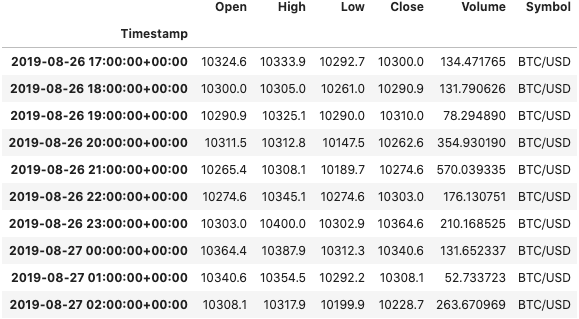

* Note that the BTC/USD prices have an hourly timescale, so that we will work with hourly data to compute the technical indicators.

* To calculate the exponential moving average of hourly return volatility (2nd trading signal), we will need to prepare the DataFrame by calculating the hourly returns of BTC/USD closing prices. Using the `dropna` function to drop any rows with NA values is a generally good practice.

  ```python
  # Drop NAs and calculate daily percent return
  btc_df["hourly_return"] = btc_df["Close"].dropna().pct_change()

  # Display sample data
  btc_df.head(10)
  ```

  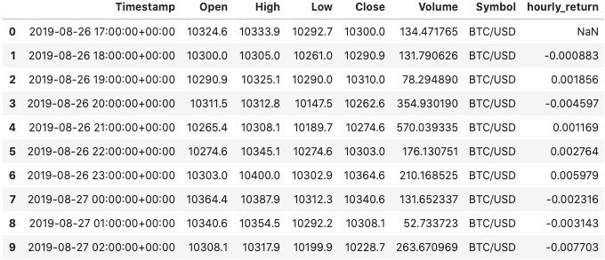

* Now that the data is prepared, we will move onto generating the multiple trading signals! Let's draw from the previous unit 15 lessons where we generated a dual moving average crossover trading signal, as the process is similar.

Explain to students that in contrast to a simple moving average (SMA), an exponential moving average (EMA) represents a moving average with more weight or focus given to the most recent prices. A short window EMA describes "faster" price action than its long window EMA or "slower" counterpart. A long trade opportunity exists when the fast EMA is greater than the slow EMA, as price action should rise in the short-term. A short trade opportunity arises for the opposite scenario when the slow EMA is greater than the fast EMA.

Students should be aware that these trading signals will incorporate a long, short, or hold strategy (rather than just long or hold, or short or hold), which is why the `crossover_signal` is calculated as the result of adding both the `crossover_long` and `crossover_short` signals together.

```python
# Set short and long windows
short_window = 1
long_window = 10

# Construct a `Fast` and `Slow` Exponential Moving Average from short and long windows, respectively
btc_df["fast_close"] = btc_df["Close"].ewm(halflife=short_window).mean()
btc_df["slow_close"] = btc_df["Close"].ewm(halflife=long_window).mean()

# Construct a crossover trading signal
btc_df["crossover_long"] = np.where(btc_df["fast_close"] > btc_df["slow_close"], 1.0, 0.0)
btc_df["crossover_short"] = np.where(btc_df["fast_close"] < btc_df["slow_close"], -1.0, 0.0)
btc_df["crossover_signal"] = btc_df["crossover_long"] + btc_df["crossover_short"]

# Display sample data
btc_df.head()
```


```python
# Plot the EMA of BTC/USD closing prices
btc_df[["Close", "fast_close", "slow_close"]].plot(figsize=(20,10))
```

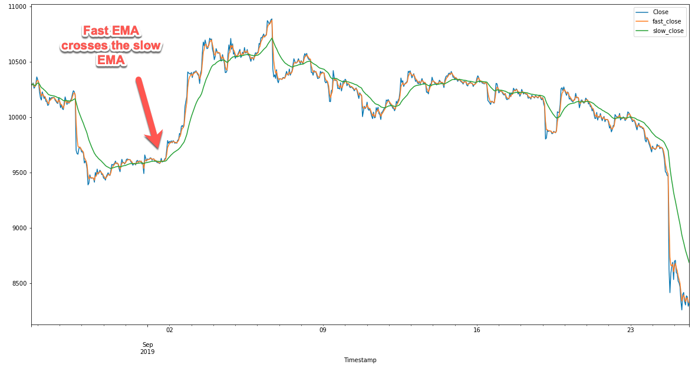

Explain to students that similarly, an exponential moving average of hourly return volatility gives more weight to the most recent hourly returns. Therefore, when a short window (fast) EMA of hourly return volatility is greater than a long window (slow) EMA of hourly return volatility, the crossover suggests that a short opportunity exists where hourly return volatility is expected to rise. This is because, during times of rising price volatility, there often exists a negative price bias (selling) and vice versa for when hourly return volatility is expected to fall (buying).

```python
# Set short and long volatility windows
short_vol_window = 1
long_vol_window = 10

# Construct a `Fast` and `Slow` Exponential Moving Average from short and long windows, respectively
btc_df["fast_vol"] = btc_df["hourly_return"].ewm(halflife=short_vol_window).std()
btc_df["slow_vol"] = btc_df["hourly_return"].ewm(halflife=long_vol_window).std()

# Construct a crossover trading signal
btc_df["vol_trend_long"] = np.where(btc_df["fast_vol"] < btc_df["slow_vol"], 1.0, 0.0)
btc_df["vol_trend_short"] = np.where(btc_df["fast_vol"] > btc_df["slow_vol"], -1.0, 0.0) 
btc_df["vol_trend_signal"] = btc_df["vol_trend_long"] + btc_df["vol_trend_short"]

# Display sample data
btc_df
```


```python
# Plot the EMA of BTC/USD daily return volatility
btc_df[["fast_vol", "slow_vol"]].plot(figsize=(20,10))
```

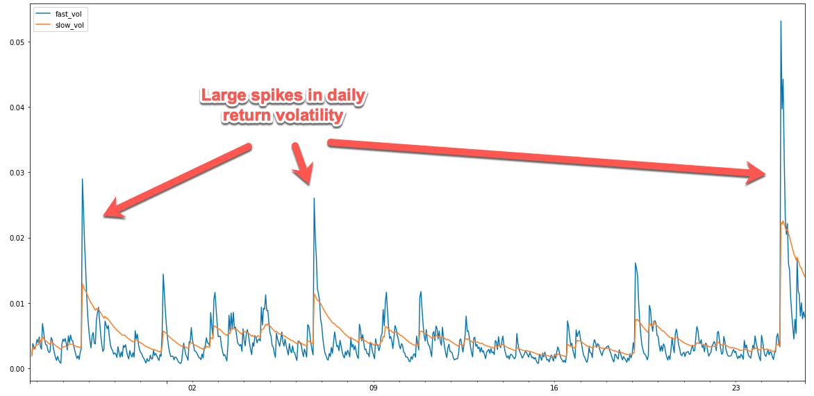

Lastly, explain to students that a Bollinger Band describes a middle, upper, and lower band, in which the middle is a simple moving average (SMA) of closing prices, while the upper and lower bands describe the rolling standard deviation above and below the SMA, respectively. Therefore, when the asset closing price is less than the lower band, a long opportunity exists as the signal suggests that the price action will tend to move upwards and more in line with where the price *should* be (within the negative standard deviation). A short opportunity exists for the opposite scenario in which the asset closing price is greater than the upper band, suggesting that the price action will tend to move lower and within the positive standard deviation.

```python
# Set bollinger band window
bollinger_window = 20

# Calculate rolling mean and standard deviation
btc_df["bollinger_mid_band"] = btc_df["Close"].rolling(window=bollinger_window).mean()
btc_df["bollinger_std"] = btc_df["Close"].rolling(window=20).std()

# Calculate upper and lowers bands of bollinger band
btc_df["bollinger_upper_band"]  = btc_df["bollinger_mid_band"] + (btc_df["bollinger_std"] * 1)
btc_df["bollinger_lower_band"]  = btc_df["bollinger_mid_band"] - (btc_df["bollinger_std"] * 1)

# Calculate bollinger band trading signal
btc_df["bollinger_long"] = np.where(btc_df["Close"] < btc_df["bollinger_lower_band"], 1.0, 0.0)
btc_df["bollinger_short"] = np.where(btc_df["Close"] > btc_df["bollinger_upper_band"], -1.0, 0.0)
btc_df["bollinger_signal"] = btc_df["bollinger_long"] + btc_df["bollinger_short"]

# Display sample data
btc_df
```


```python
# Plot the Bollinger Bands for BTC/USD closing prices
btc_df[["Close","bollinger_mid_band","bollinger_upper_band","bollinger_lower_band"]].plot(figsize=(20,10))
```

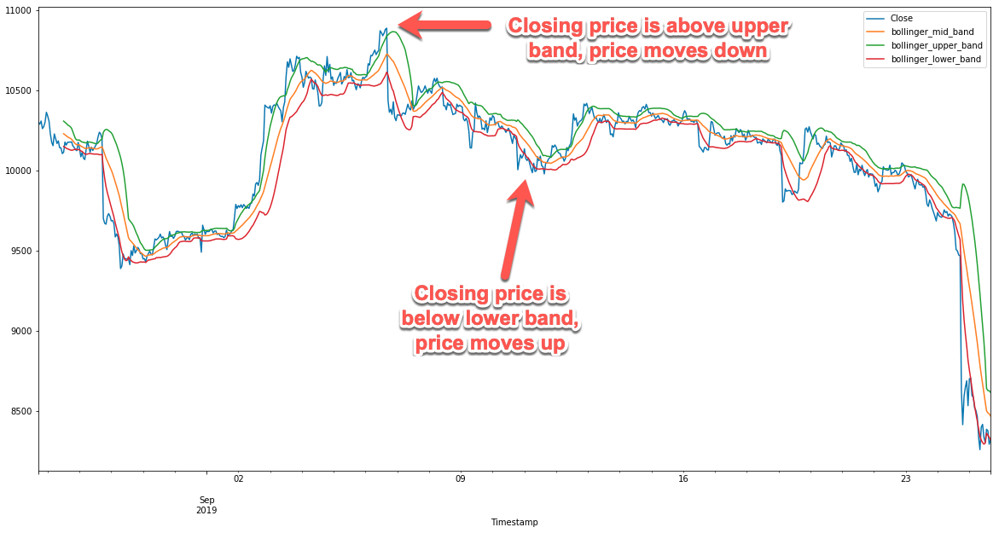

At the end of the discussion, ask students whether or not they understand what the trading signals are suggesting. This is important as these trading signals will train the Random Forest model.

---

### 2. Instructor Do: Random Forest Trading (15 min)

**Corresponding Activity:** [02-Ins_Random_Forest_Training](Activities/02-Ins_Random_Forest_Training)

In this activity, students will learn how to use the set of trading signal features we generated in the previous activity to train a Random Forest machine learning model.

**File:** [random_forest_training.ipynb](Activities/02-Ins_Random_Forest_Training/Solved/random_forest_training.ipynb)

Before proceeding with the coding activity, open the slides, and briefly recap the use of machine learning models in regards to trading. Highlight the following:

* How will we incorporate a machine learning model in terms of trading?

  **Answer:** Machine learning models need to be trained before they can make predictions. The Random Forest model will train itself using the trading signals generated from the previous activity as independent variables that determine a dependent variable (a positive or negative return for the next day). The model can be saved as a pre-trained model for later use and loaded again for easy deployment.

* What is a Random Forest model?

  **Answer:** A Random Forest model is among one of the best-supervised algorithms in terms of its ability to predict outcomes. The Random Forest model utilizes a combination of multiple decision tree models to "average away" or minimize the impact of any single decision tree with high variance, thereby creating a more reliable predicted result derived from the strongest features. For example, in regards to portfolio optimization, combining the concept of sharp ratios and portfolio diversification tends to create a portfolio of maximum expected return with minimal variance or risk due to the tendency for the non-correlated stock to "cancel" out each other's variances.

* Why is it called a Random Forest?

  **Answer:** A Random Forest model is a combination of many decision tree models with each decision tree or "tree" randomly selecting a subset of the observations and features to train itself on. The result is a final prediction that is an average across this "forest" of random trees.

Then, open the solution file and discuss the following:

* The trading signal data from the previous activity has been saved for students' convenience. Therefore, the only pre-requisite needed before training the Random Forest model is to read the CSV, set the index to the `Timestamp` column, and drop the extraneous column.

  ```python
  # Set path to CSV and read in CSV
  csv_path = Path("../Resources/trading_signals.csv")
  trading_signals_df=pd.read_csv(csv_path)
  trading_signals_df.head()
  ```

  

  ```python
  # Set index as datetime object and drop extraneous columns
  trading_signals_df = trading_signals_df.set_index(pd.to_datetime(trading_signals_df["Timestamp"], infer_datetime_format=True))
  trading_signals_df = trading_signals_df.drop(columns=["Timestamp"])
  trading_signals_df
  ```

  

* Now that the data is prepared, the next step is to define the x-variable list and shift the index of the Pandas DataFrame by 1. The shift ensures that the model will use the current day values to predict the *next* day's outcome--whether the next day will be a positive or negative return.

  ```python
  # Set x variable list of features
  x_var_list = ["crossover_signal", "vol_trend_signal", "bollinger_signal"]

  # Filter by x-variable list
  trading_signals_df[x_var_list].tail()
  ```

  

  ```python
  # Shift DataFrame values by 1
  trading_signals_df[x_var_list] = trading_signals_df[x_var_list].shift(1)
  trading_signals_df[x_var_list].tail()
  ```

  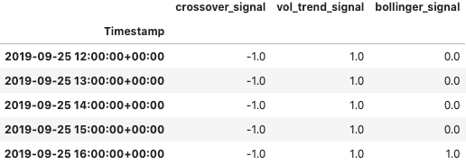

* It is also important to check for any positive or negative infinity values, as such values will cause problems when subsequently training the model.

  ```python
  # Drop NAs
  trading_signals_df = trading_signals_df.dropna(subset=x_var_list)
  trading_signals_df = trading_signals_df.dropna(subset=["hourly_return"])

  # Replace positive/negative infinity values
  trading_signals_df = trading_signals_df.replace([np.inf, -np.inf], np.nan)

  # Display sample data
  trading_signals_df.head()
  ```

  

  > **Note:** Be aware that if we don't remove NAN and infinity values, the following error may arise.
  > 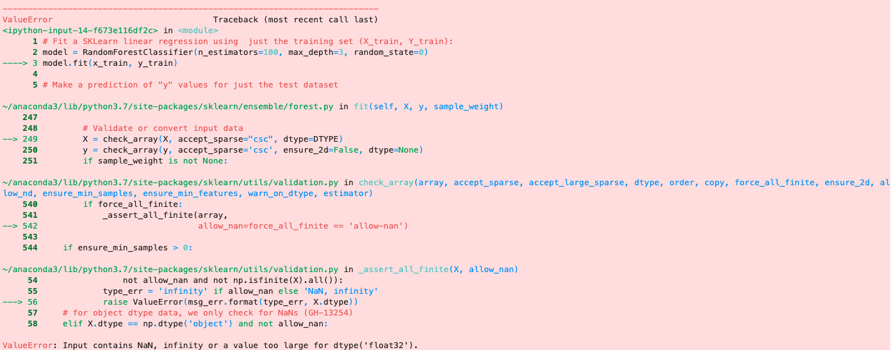


* Finally, we construct the dependent variable. We add a column called `Positive Return` where if `hourly_return` is greater than 0, then we set a value of 1, else, 0.

  ```python
  # Construct the dependent variable where if hourly return is greater than 0, then 1, else, 0.
  trading_signals_df["Positive Return"] = np.where(trading_signals_df["hourly_return"] > 0, 1.0, 0.0)

  # Display sample data
  trading_signals_df
  ```

  

* Almost there! The final remaining steps before proceeding to train the Random Forest model is to now define the training and test windows and separate the `X` and `Y` training/testing datasets.

  ```python
  # Construct training start and end dates
  training_start = trading_signals_df.index.min().strftime(format= "%Y-%m-%d")
  training_end = "2019-09-14"

  # Construct testing start and end dates
  testing_start =  "2019-09-15"
  testing_end = trading_signals_df.index.max().strftime(format= "%Y-%m-%d")

  # Print training and testing start/end dates
  print(f"Training Start: {training_start}")
  print(f"Training End: {training_end}")
  print(f"Testing Start: {testing_start}")
  print(f"Testing End: {testing_end}")
  ```

  ```text
  Training Start: 2019-08-26
  Training End: 2019-09-14
  Testing Start: 2019-09-15
  Testing End: 2019-09-25
  ```

  ```python
  # Construct the X_train and y_train datasets
  X_train = trading_signals_df[x_var_list][training_start:training_end]
  y_train = trading_signals_df["Positive Return"][training_start:training_end]

  # Display sample data
  display(X_train.tail())
  display(y_train.tail())
  ```

  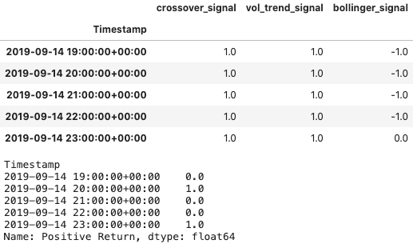

  ```python
  # Construct the X test and y test datasets
  X_test = trading_signals_df[x_var_list][testing_start:testing_end]
  y_test = trading_signals_df["Positive Return"][testing_start:testing_end]

  # Display sample data
  display(X_test.tail())
  display(y_test.tail())
  ```

  

* And now for the last piece to the puzzle! After importing the `sklearn` library and associated Random Forest classes, the model is fitted with the `X` and `y` training data and then used to predict the `y` values derived from the `X` test dataset. The results are then shown in a DataFrame.

  ```python
  # Import sklearn required libraries
  from sklearn.ensemble import RandomForestClassifier
  from sklearn.datasets import make_classification

  # Fit a SKLearn random forest using just the training set (X_train, Y_train):
  model = RandomForestClassifier(n_estimators=100, max_depth=3, random_state=0)
  model.fit(X_train, y_train)

  # Make a prediction of "y" values from the X_test dataset
  predictions = model.predict(X_test)

  # Assemble actual y data (Y_test) with predicted y data (from just above) into two columns in a DataFrame
  results = y_test.to_frame()
  results["Predicted Value"] = predictions

  # Display sample data
  results
  ```

  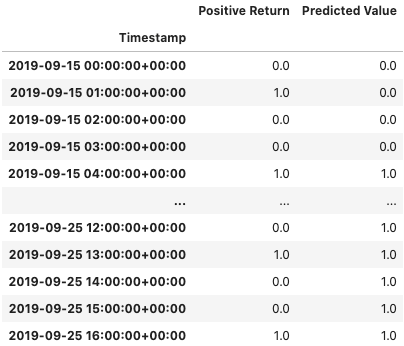

* Finally, the `joblib` library allows a user to save a pre-trained model to a file for convenient future deployment. Doing so can be very valuable as fitting a model can be resource-intensive when dealing with large amounts of data, therefore persisting a model saves both time and effort (re-running code).

  ```python
  # Save the pre-trained model
  from joblib import dump, load
  dump(model, "random_forest_model.joblib")
  ```

Be sure that there are no questions before moving forward.

---

### 3. Instructor Do: Reusing a Machine Learning Trading Model (15 min)

**Corresponding Activity:** [03-Ins_Reusing_Random_Forest_Model](Activities/03-Ins_Reusing_Random_Forest_Model)

In this activity, students will learn how to re-deploy a pre-trained Random Forest model to make predictions (positive or negative daily return) given the `X` test dataset of BTC/USD closing prices. Then, students will learn to compare the actual results vs. the predicted results and backtest the Random Forest model given a capital allocation of $100,000.

**File:** [random_forest_trading.ipynb](Activities/03-Ins_Reusing_Random_Forest_Model/Solved/random_forest_trading.ipynb)

Briefly discuss the following before proceeding to the coding solution:

* Now that the pre-trained Random Forest model has been saved, re-deploying the model to make predictions becomes very straightforward--all that needs to be done is to feed in the `X` test data (trading signal data) and compare against the `y` test data (actual hourly return results).

* Deploying an already trained model saves time and effort, offloading the need for developers to have to prepare the data, split the data (train and test datasets), and fit the model before finally being able to use the model to make predictions.

Open the solution file and discuss the following:

* For convenience, the `X` test and `y` test (actual results) datasets have been provided as CSVs. The remaining pre-requisites before loading and making predictions from the pre-trained model are to once again set the indexes to the DataFrames as `Timestamp` (a datetime object) and drop the extraneous columns.

  ```python
  # Set path to CSV and read X test data in CSV
  csv_path = Path("../Resources/X_test.csv")
  X_test=pd.read_csv(csv_path)

  # Set Timestamp column as the index
  X_test = X_test.set_index(pd.to_datetime(X_test["Timestamp"], infer_datetime_format=True))
  X_test = X_test.drop(columns=["Timestamp"])

  # Display sample data
  X_test.head()
  ```

  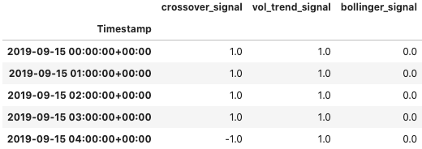

  ```python
  # Set path to CSV and read y test data (results) in CSV
  csv_path = Path("../Resources/results.csv")
  results = pd.read_csv(csv_path)

  # Set Timestamp column as the index
  results = results.set_index(pd.to_datetime(results["Timestamp"], infer_datetime_format=True))
  results = results.drop(columns=["Timestamp"])

  # Display sample data
  results.head()
  ```

  

* One, two, three, predict! By using a pre-trained Random forest model that has already been saved, the process of deploying the pre-trained model and making predictions becomes a mere two lines of code. Aligning the actual results vs. the predicted results within a DataFrame then makes for a more aesthetically pleasing comparison.

  ```python
  # Load the model and make the predictions from the X_test dataset
  model = load("../Resources/random_forest_model.joblib")
  predictions = model.predict(X_test)

  # Display sample predictions
  predictions[:10]
  ```

  ```text
  array([0., 0., 0., 0., 1., 1., 1., 1., 1., 1.])
  ```

  ```python
  # Add predicted results to DataFrame
  results["Predicted Value"] = predictions

  # Display sampe data
  results.head(10)
  ```

  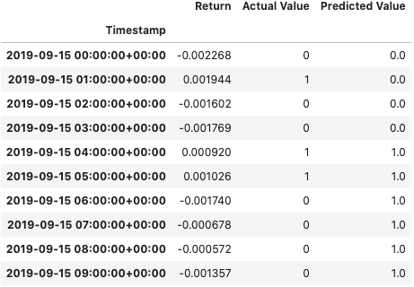

* The comparative results can then be plotted to show the turnover of the Random Forest model. In other words, the following plot shows how many times the model predicted that a particular day would be positive or negative based on the features or trading signals.

  ```python
  # Plot predicted results vs. actual results
  results[["Actual Value", "Predicted Value"]].plot(figsize=(20,10))
  ```

  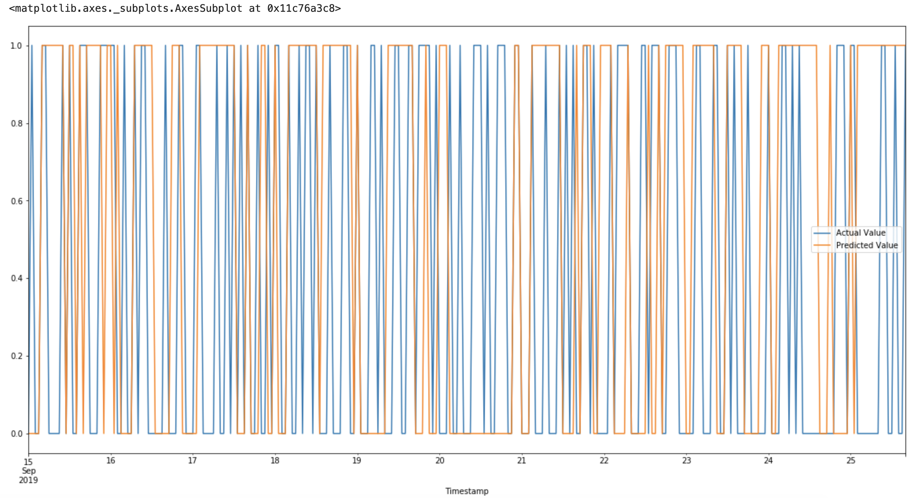

* Viewing the totality of the actual vs. predicted results can be hard to decipher, therefore viewing a small portion such as the last 10 records provides a better understanding of how the model performs.

  ```python
  # Plot last 10 records of predicted vs. actual results
  results[["Actual Value", "Predicted Value"]].tail(10).plot()
  ```

  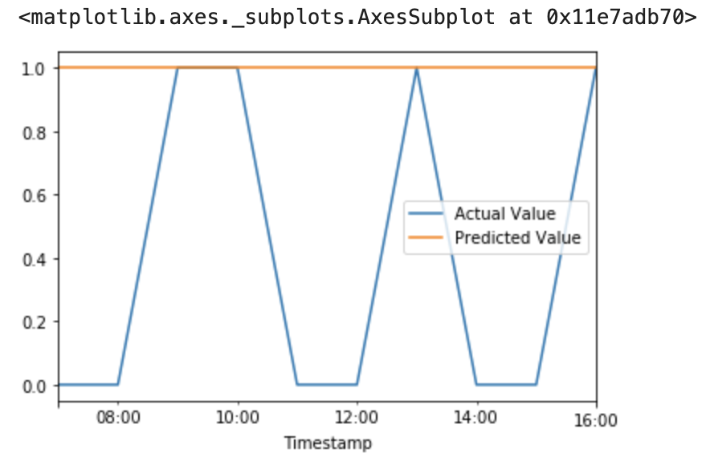

* In this case, in order to activate the shorting feature of the trading model, it is necessary to replace the predicted values from `0` to `-1`. This is because in the following line for calculating cumulative returns of the trading model, the predicted value needs to be a negative number when multiplying against a negative daily return to produce a positive result. Otherwise, predicted values being just `0` or `1` would employ a long-hold strategy rather than the long-short-hold strategy desired.

  ```python
  # Replace predicted values 0 to -1 to account for shorting
  results["Predicted Value"] = results["Predicted Value"].replace(0, -1)

  # Display sample data
  results
  ```

  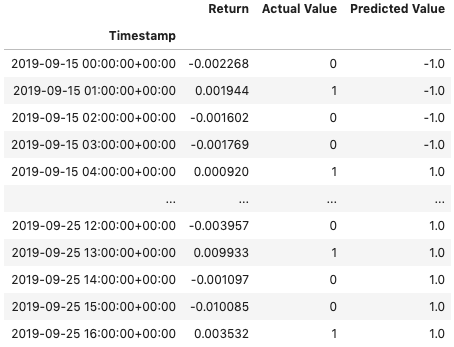

* Next, after calculating the cumulative returns of the model by multiplying the hourly returns (actual results) against the predicted values, we can see that the model would have unfortunately lost money from 09-15-2019 to 09-25-2019 trading on BTC/USD hourly prices. This is to be expected, however, as the process for training and using a trading model can be straightforward, but the ability to create a sophisticated trading model that outperforms markets is not--otherwise, there would be no more finance jobs as machines would run the markets!

  ```python
  # Calculate cumulative return of the model
  cumulative_return = (1 + (results["Return"] * results["Predicted Value"])).cumprod()

  # Plotting cumulative returns
  cumulative_return.plot()
  ```

  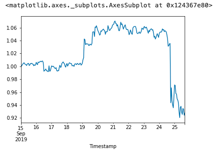

* Finally, backtesting the performance of the trading model by multiplying its cumulative returns against an initial capital allocation of $100,000 merely serves to visualize its performance in terms of capital.

  ```python
  # Set initial capital allocation
  initial_capital = 100000

  # Plot cumulative return of model in terms of capital
  cumulative_return_capital = initial_capital * cumulative_return
  cumulative_return_capital.plot()
  ```

  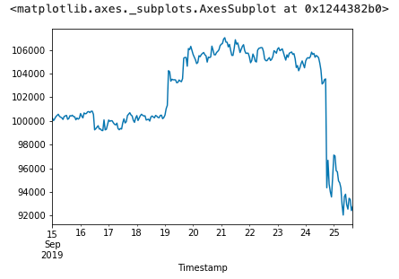

Be sure that there are no questions before moving forward.

---

### 4. Instructor Do: Recap (15 min)

In this activity, instructors will briefly re-cap the process of training and using a Random Forest trading model, discuss the ways in which the model can potentially be improved, and consider deploying the model through alternative means such as AWS' Sagemaker--a machine learning cloud service that enables users to build, train, and deploy machine learning models quickly and conveniently.

Open the slideshow and quickly recap the following. Engage students by having them answer the questions wherever possible:

* What did we learn today?

  **Answer:** We learned how to implement a machine learning model (Random Forest) to make predictions of next-day daily returns, given a set of trading signals derived from raw asset closing prices.

* What was the process for implementing a machine learning trading model?

  **Answer** The process for implementing a machine learning model, regardless of domain, generally includes the following: preparing the data, splitting the data into train and test datasets, fitting the `X` and `y` train data to the model, making predictions from the `X` test data, and comparing the predicted results to the `y` test data (actual results) to evaluate the performance of the overall model.

* What was the main takeaway from today's lesson?

  **Answer:** That the process for implementing a machine learning trading model can be fairly straightforward, but the ability to construct a sophisticated enough trading model that can outperform the markets will require more effort via a further understanding of the markets and fine-tuning of the model (more features and therefore information).

Then, ask students if they have any further questions before moving onto the following talking points regarding model improvement:

* Admittedly, the Random Forest trading model still has room for improvement before it can be considered a robust system for automated machine learning-based trading. This is because while the activities aim to simplify the process for implementation to provide beginner insight, the trade-off in complexity affects the overall performance of the model. In particular, several factors could have benefited the training and, therefore, overall performance of the Random Forest trading model, such as using more observations or data, more features or variables, and continuous rather than binary calculations for trading signals.

* The number of observations and features supplied to the model for training can be increased to provide more information, and therefore a better understanding for the model to make more accurate predictions. In this case, there were only 462 observations and 3 features upon which the model was trained.

  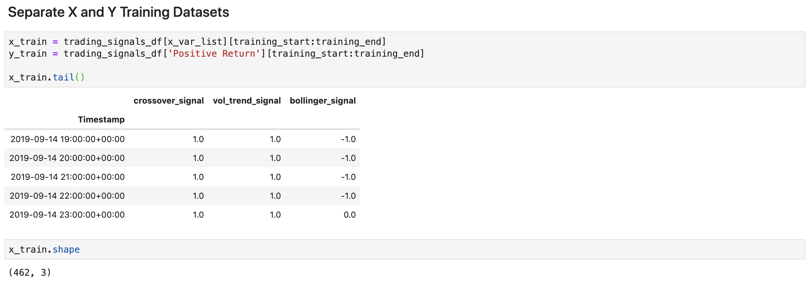

* In addition, for simplicity, the trading signals were binary output - either 0 or 1, meaning do not engage in the trade or engage in the trade. However, if a scaled continuous value were used instead of a binary value, the *extent* upon which a trading signal is defined or how *far* the values differ from the crossover point, could be used to provide more information to train the model.

  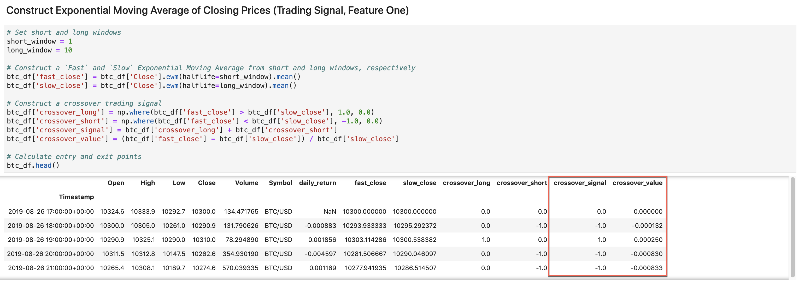

* Lastly, a lot of effort and time is spent on collecting and preparing training data. Therefore, as an alternative solution, Amazon SageMaker, a machine learning cloud service that enables users to build, train, and deploy machine learning models quickly and conveniently, could be used to minimize the work effort spent on preparing data and instead focus on optimizing the accuracy or performance of the model. Amazon SageMaker also provides several methods for accessing its functionality, such as via the AWS web GUI, specific API endpoints, or the SageMaker Python SDK.

  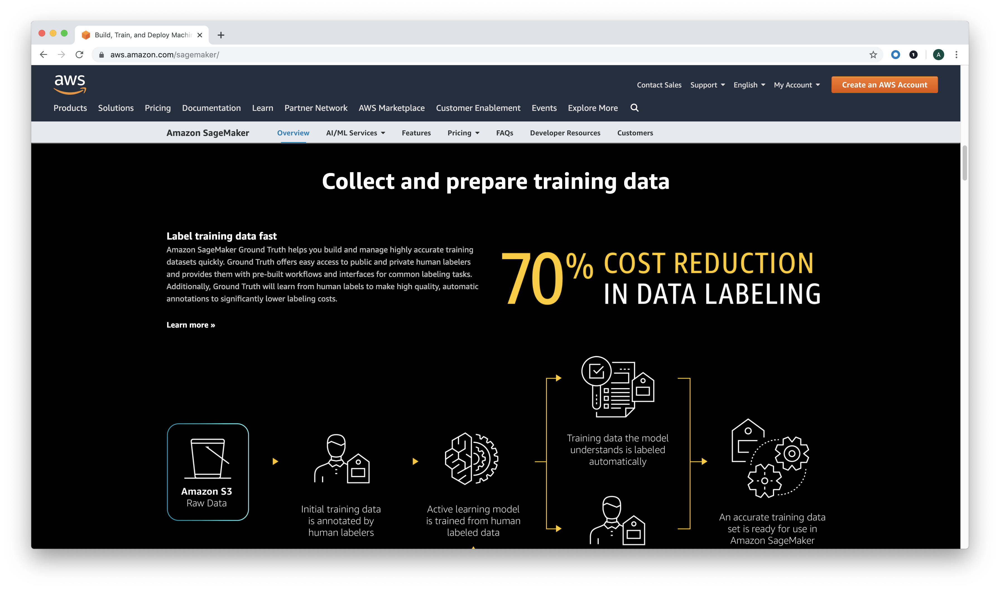

Finally, end the lesson with some encouragement for students:

* Today marks the end of everything we have learned so far in the course! At this point in time, you have learned to not only use Python and its various libraries but also learn how to implement machine learning based strategies to derive predictive insight. You should feel very proud, as you have reached a technical milestone that many have yet to accomplish and that you are on your way to becoming data scientists!

* Looking toward the horizon, you will soon delve deep into the world of Blockchain technology or the next generation digital economy. With your now refined data analytic skills matched with machine learning capabilities, you will become absolute rock stars in the FinTech space once you add Blockchain to your technical repertoire!

Be sure that there are no questions before moving forward.

---

### 5. Instructor Do: Intro to Project 2 (120 mins)

Congratulate the class on having made it this far!

Explain that, over the next two class weeks, students will work in groups to complete their 2nd project for FinTech.

Share the project guidelines with students: [Project 2 Guidelines](https://github.com/coding-boot-camp/FinTech-Lesson-Plans/blob/master/03-Projects/Project-02/ProjectGuidelines.md). Using this documents, present the project guidelines to the class. Be sure to highlight the following:
 
Explain that students can choose **any topic** from the sections covered so far.

Tell students that they will also be able to choose their teams of 2-6 students for this final project. Students are also able to request placement on a team by the instructional staff.

It is highly recommended to request project proposals from students and then approve their proposals. Students will often struggle with setting realistic goals, so use this as an opportunity to guide them to unique, interesting, and achievable projects.

Explain that the rest of the class will be dedicated to working on their final projects.

---

© 2021 Trilogy Education Services, a 2U, Inc. brand. All Rights Reserved.
